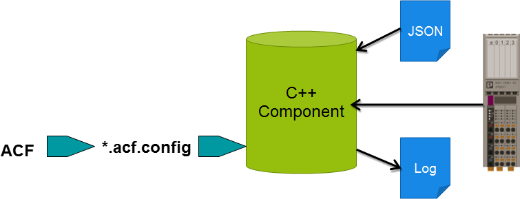

#  E-Learning: Internal Function Extensions

## Table of contents

<!-- TOC depthFrom:2 orderedList:true -->

- [Introduction](#introduction)
- [Guide details](#guide-details)
- [When to use Internal Function Extensions](#when-to-use-internal-function-extensions)
- [Limitations](#limitations)
- [Quick-start example](#quick-start-example)
- [IMPORTANT NOTE on acyclic communication service](#important-note-on-acyclic-communication-service)

<!-- /TOC -->

## Introduction

The Internal Function Extensions allows to access the I/O Data, GDS(Global Data Space) and using of services provided by the PLCnext Control platform (e.g. RSC services).

## Guide details
|Description | Value |
|------------ |-----------|
|Created | 15.11.2019 |
|Last modified| 18.11.2019 |
|Controller| AXC F 2152 |
|FW|2019.9|
|Arpversion| 19.9.0.23151|
|SVN Revision|23151|
|SDK| 19.9.0.23151 |
|PLCnext CLI | 2020.0 LTS|

## When to use Internal Function Extensions

Internal Function Extensions are useful when non-real-time data must be processed on a PLCnext Control, e.g.:
- if your application needs deterministic real-time capability and non-real-time capability, you can divide your application in two parts for optimization of CPU resources
- if you use RSC services for data access on GDS (Global Data Space) data and/or on Axioline I/O data in non-real-time context
- to configure Axioline modules.

## Limitations

Internal Function Extensions are not designed to operate in a real-time context.

## Quick start example

This example demonstrates features of Internal Function Extensions. 

An ACF component is created which should fulfill the following tasks:

- Axioline PDI data should be read via RSC and be written to the diagnostic log file.
- The data to be read can be specified in a JSON configuration file.
- The selection of the module that provides the PDI data can be set via the process data inputs of the Axioline module. On the PLCnext Starter Kit, the process data inputs are connected to a switch module. If e.g. the second Axioline module has to provide data, the switch 1 must be set to true, because this results in binary two.

### Prerequisites:

- Starterkit - AXC F 2152 STARTERKIT (Order Number: 1046568)

- PLCnext Command Line Interface (CLI) tool, version 2020.0 LTS. This is included in the "PLCnext Technology C++ tool chain", available on the Phoenix Contact website.

- Software Development Kit (SDK) for the AXC F 2152 PLCnext Control, version 2019.9. This is available on the Phoenix Contact website, and must be installed using the PLCnext CLI.

- PLCnext Engineer version 2019.9.

- WinSCP or a similar software, incl. PuTTY

### Procedure:

- Please exercise the e-learning ["Internal Function Extensions"](http://plcnext-infocenter.s3-website.eu-central-1.amazonaws.com/PLCnext_elearning_InternalFunctionExtensions/PLCnext%20Technology%20-%20Internal%20Function%20Extensions/story_html5.html)

### Procedure steps shown in the e-learning and Quick-start:

1)	Establish the communication between PLCnext Control and computer.
2)	Create a PLCnext Engineer project `Proj_BusConfig.pcwex` with busconfiguration `AXL F DI8/1 DO8/1 1H` as first axioline modul and (optional) `AXL F AI2 AO2 1H` as second axioline modul.
3)  Load the PLCnext Engineer project onto the PLCnext Control.
4)	Download the RapidJSON library from repository: [RapidJSON](https://github.com/Tencent/rapidjson) and unzip it.
5)  RapidJSON is a header-only C++ library, just copy the `include/rapidjson` folder to the SDK folder on your computer `sysroots/cortexa9t2hf-neon-pxc-linux-gnueabi/usr/include`.
6)  In Eclipse® create a ACF-Project `LIB_AxioRead` with component `COMP_AxioRead`.
7)  In the project replace the files `COMP_AxioRead.cpp` and `COMP_AxioRead.hpp` with files contained in the `src` directory of this repository.
8)	Refresh and compile the`LIB_AxioRead` Eclipse® project.
9)	Use WinSCP to establish an SFTP connection with PLCnext Control.
10)	Find the shared object `libLIB_AxioRead.so` in an Eclipse® workspace directory e.g. `LIB_AxioRead\bin\AXCF2152_19.9.0.23151\Release\lib` and copy it to the `/opt/plcnext/projects/Components` PLC's directory.
11)	Copy the “AxioReadConfig.schema.json” and the “AxioReadConfig.json” file (contained in the `data` directory of this repository) to the `/opt/plcnext/projects/Components` PLC's directory.
12)	Copy the `LIB_AxioReadLibrary.acf.config` file (contained in the `data` directory of this repository) to the `/opt/plcnext/projects/Default` PLC's directory. All `.acf.config` files in this directory are processed by the ACF when the plcnext process starts up.
13)	Restart the PLCnext process via command line `sudo /etc/init.d/plcnext restart` in the PuTTY terminal.
14)	Check that your application has started successfully by changing the DI-Signals on `AXL F DI8/1 DO8/1 1H` mudul and examining the PLCnext log file: `/opt/plcnext/logs/Output.log`.
   

## IMPORTANT NOTE on Internal Function Extensions

- If you think about using the "PdiRead" and "PdiWrite" methods of pAcyclicCommunicationService to transfer the process data to the real-time application - please don't!
- For applications that need real-time access to I/O data, the easiest and fastest way is to create your C++ application in the PLCnext Technology Eclipse® Add-in - using PLCnext components, programs and port variables from the template for real-time applications.
- If the access to the real-time process data is required for external application running directly on the Linux OS, then the best solution is to use the [Sample Runtime](https://github.com/PLCnext/SampleRuntime) example, which is designed especially for this purpose.
