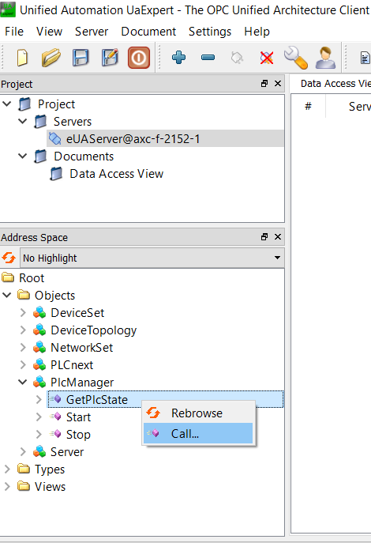

# OPC UA Method Example

## Table of contents

<!-- TOC depthFrom:2 orderedList:true -->

- [Introduction](#introduction)
- [Guide details](#guide-details)
- [Quick-start example](#quick-start-example)

<!-- /TOC -->

## Introduction

This example shows how to use OPC UA methods to execute functions in an ACF component written in C++.

To understand how to create and use OPC UA methods with PLCnext Control devices, the following tutorial should be completed:

https://github.com/PLCnext/OpcUaMethods

The concepts and procedures demonstrated in that tutorial were used to prepare this example.

This example also uses the [PLC Manager](https://api.plcnext.help/api_docs_2021-0-LTS/classArp_1_1Plc_1_1Domain_1_1Services_1_1IPlcManagerService2.html) RSC service.

## Guide details

|Description | Value |
|------------ |-----------|
|Created | 19.03.2021 |
|Last modified| 19.03.2021 |
|Controller| AXC F 2152 |
|FW| 2021.0.3 LTS |
|Arpversion| 21.0.3.35554 |
|SVN Revision| 35554 |
|SDK| 2021.0.3 LTS (21.0.3.35554) |
|PLCnext CLI | 21.0.0 LTS (21.0.0.489) |

## Quick-start example

It is assumed that the user has some experience [building C++ Components and Programs for PLCnext Control](https://plcnext.help/te/Programming/Cplusplus/Cpp_programs_in_PLCnext.htm).

Prerequisites:

- AXC F x152 controller.

- PLCnext Command Line Interface (CLI) tool, version 2021.0. This is included in the "PLCnext Technology C++ tool chain", available on the Phoenix Contact website.

- A Software Development Kit (SDK) for the AXC F x152 PLCnext Control. This is also included in the "PLCnext Technology C++ tool chain".

- PLCnext Engineer software.

- (optional) Eclipse IDE, with the PLCnext Technology feature installed.

- (optional) Visual Studio, with the PLCnext Technology add-in installed.

- [UaExpert](https://www.unified-automation.com/products/development-tools/uaexpert.html) from Unified Automation.

Procedure:

- In PLCnext Engineer, create a new project based on the template for your PLC and firmware version.

- Change the [OPC UA server settings](https://plcnext.help/te/Communication_interfaces/OPC_UA/OPCUA_server_configuration.htm) so that "Visibility of variables" is set to either "Marked" or "All".

- Write and start the PLCnext Engineer project on the PLC. The only purpose of this PLCnext Engineer project is to configure the OPC UA server to make the GDS port variables, defined in our ACF component, available to OPC UA clients.

- Clone this repository, e.g.

   ```sh
   git clone https://github.com/PLCnext/CppExamples.git
   ```

- Copy the OPC UA Node Set file to the PLC (replacing the IP address with the IP address of your PLC), e.g:

   ```sh
   cd CppExamples/Examples/OpcPlcManager
   scp PlcManager.xml admin@192.168.1.10:~/projects/Default/Services/OpcUA/NodeSets
   ```

   This `.xml` file, in OPC UA Node Set format, defines the OPC UA methods that are implemented by our ACF component.

- Create a new **ACF project** using either the PLCnext CLI tool, or Eclipse, or Visual Studio, with the following settings:
  - Project name: `OpcPlcManager`
  - Component name: `OpcPlcManagerComponent`
  - Project namespace: `OpcPlcManager`

- Copy the contents of the `Examples/OpcPlcManager/src` directory in this repository, to the `src` directory of the ACF project. Replace the existing source files with the same name.

- Build the ACF project.

- Deploy the ACF project to the PLC, using the `.acf.config` file in the `Examples/OpcPlcManager/src` directory. This configuration file includes the name of the component instance that is referenced by the Node Set configuration file.

- Restart the PLCnext Runtime.

- Start UA Expert.

- Connect to the OPC UA server on the PLC.

- Call the methods in the "PlcManager" node to read the current PLC state, and to stop and start the PLC component of the PLCnext Runtime.

   
