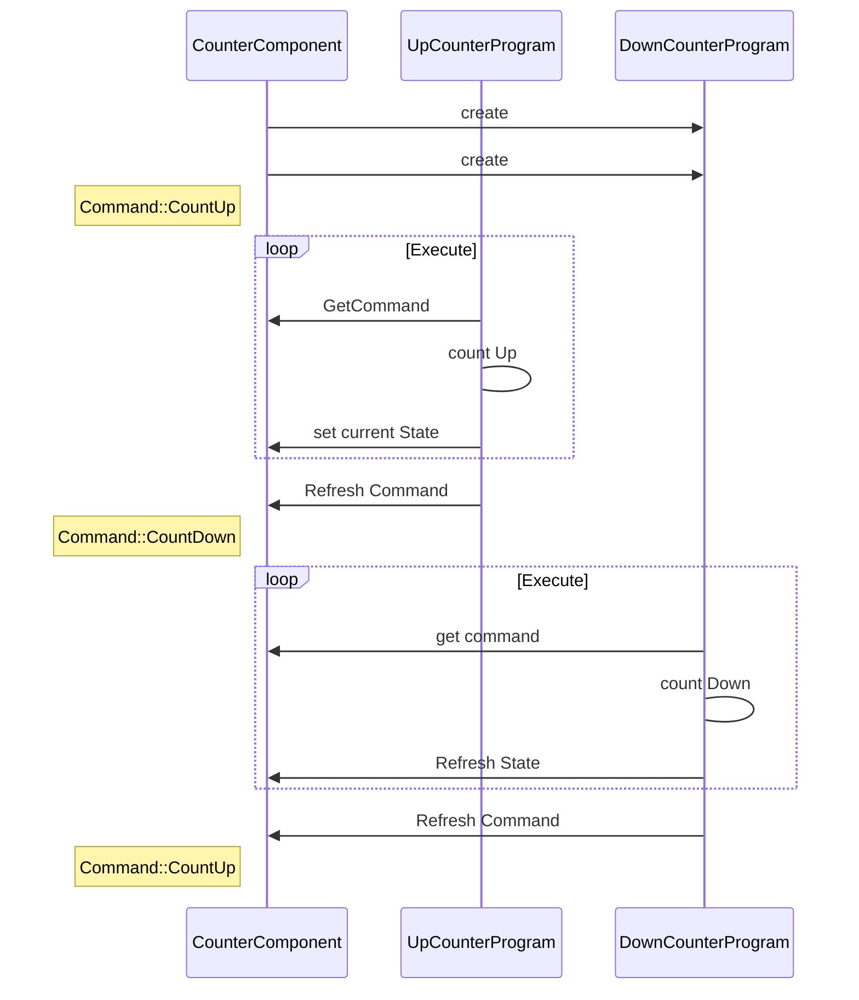
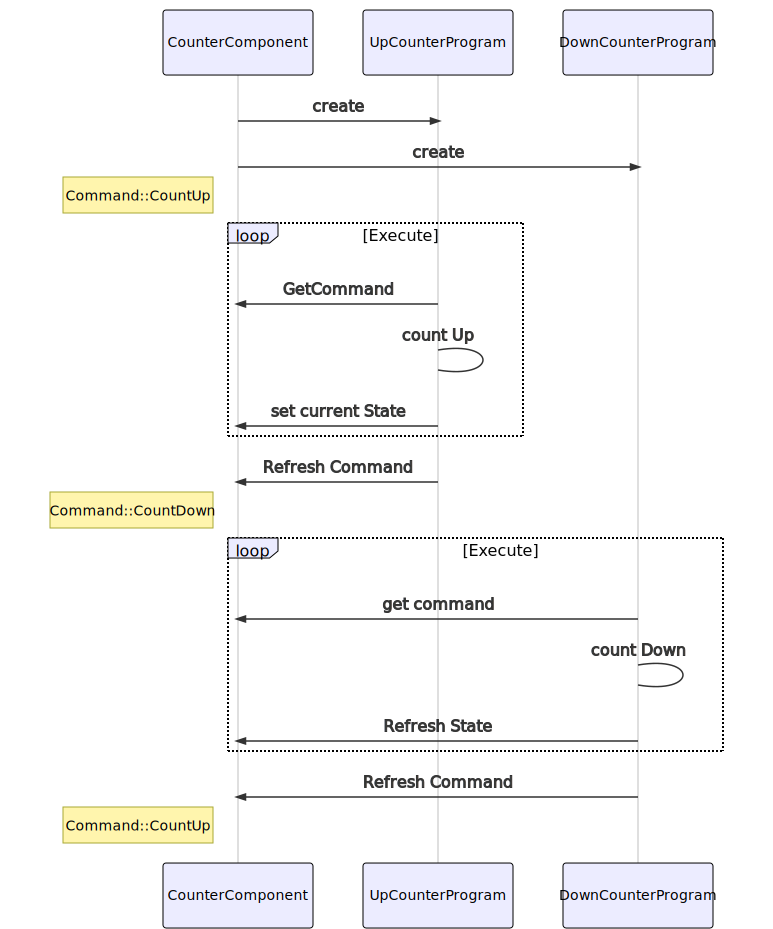

# Program Component Interaction 
This example shows how data can be sent from a program to a component.
The program can also receive data by calling public getter methods of the component.

The *UpCounterProgram* and *DownCounterProgram* access the *CounterComponent* with these methods.
They use the *CounterComponent.GetCommand()* to receive an *enum* of *Commands* and a *setProgress()* method to inform the component of the state of the program.
Once the program has received a command it will continue to execute this command, and - when finished - execute the *CounterComponent.RefreshState()* method which will then initiate a state change.

<!-- Original mermaid source, for when github decides to allow it.

-->

## Example details
|Description | Value |
|------------ |-----------|
|Controller | AXC F 2152 | 
|FW | 2020.6.1 |
|SDK | 2020.6.1 |
|PLCnext Engineer | 2020.6 |

## Preconditions

- PLCnext Engineer is installed 
- PLCnext Technology SDK for C++ is installed

## Start-up instructions

1. Create one instance of each Program
2. Start the PLCnext Control
3. Login with PLCnext Engineer Debug or SSH.
4. Check progress

You can now see the counters going up and down in the *PLCnext - Port List* window in PLCnext Engineer. The value of the `Down_Counter` port on the `DownCounterProgram` instance will decrement from 255 to zero, then the value of the `UP_Counter` port on the `UpCounterProgram` instance will increment from zero to 255.

You can see also the progress in the *Output.log* file with `tail -f /opt/plcnext/logs/Output.log`.